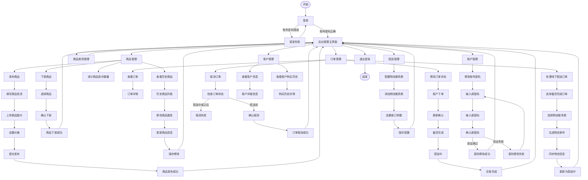

```mermaid
flowchart TD
    Start([开始]) --> Login[登录]
    Login -- 账号密码错误 --> LoginFail[登录失败]
    LoginFail --> Login
    
    Login -- 账号密码正确 --> Dashboard[后台管理主界面]
    
    %% 商品管理相关流程
    Dashboard --> ProductManagement[商品管理]
    ProductManagement --> AddProduct[发布商品]
    ProductManagement --> RemoveProduct[下架商品]
    ProductManagement --> ViewHistoryProducts[查看历史商品]
    ProductManagement --> AdjustInventory[减少商品库存数量]
    
    AddProduct --> FillProductInfo[填写商品信息]
    FillProductInfo --> UploadImages[上传商品图片]
    UploadImages --> SetPrice[设置价格]
    SetPrice --> SubmitProduct[提交发布]
    SubmitProduct --> ProductPublished[商品发布成功]
    
    RemoveProduct --> SelectProduct[选择商品]
    SelectProduct --> ConfirmRemoval[确认下架]
    ConfirmRemoval --> ProductRemoved[商品下架成功]
    
    ViewHistoryProducts --> HistoryProductList[历史商品列表]
    HistoryProductList --> EditProduct[修改商品属性]
    EditProduct --> UpdateProductInfo[更新商品信息]
    UpdateProductInfo --> SaveProductChanges[保存修改]
    
    %% 商品类别管理独立页面 - 简化版
    Dashboard --> CategoryManagement[商品类别管理]
    
    %% 订单管理相关流程与线性状态变化
    Dashboard --> OrderManagement[订单管理]
    OrderManagement --> ViewOrders[查看订单]
    OrderManagement --> UpdateOrderStatus[修改订单状态]
    OrderManagement --> CancelOrder[取消订单]
    OrderManagement --> ProcessDelivery[处理线下配送订单]
    
    ViewOrders --> OrderDetails[订单详情]
    
    UpdateOrderStatus --> CustomerOrder[客户下单]
    CustomerOrder --> MerchantConfirm[商家确认]
    MerchantConfirm --> StockReady[备货完成]
    StockReady --> Delivering[配送中]
    Delivering --> TransactionComplete[交易完成]
    
    CancelOrder --> CheckOrderStatus[检查订单状态]
    CheckOrderStatus -- 配送前 --> ConfirmCancellation[确认取消]
    ConfirmCancellation --> OrderCancelled[订单取消成功]
    CheckOrderStatus -- 配送中或之后 --> CancellationFailed[取消失败]
    
    ProcessDelivery --> SelectReadyOrder[选择备货完成订单]
    SelectReadyOrder --> SelectLogistics[选择物流服务商]
    SelectLogistics --> GenerateTrackingNumber[生成物流单号]
    GenerateTrackingNumber --> SyncLogisticsInfo[同步物流信息]
    SyncLogisticsInfo --> UpdateToDelivering[更新为配送中]
    
    %% 客户管理相关流程
    Dashboard --> CustomerManagement[客户管理]
    CustomerManagement --> ViewCustomerInfo[查看客户信息]
    CustomerManagement --> ViewPurchaseHistory[查看客户购买历史]
    
    ViewCustomerInfo --> CustomerDetails[客户详细信息]
    ViewPurchaseHistory --> PurchaseHistoryDetails[购买历史详情]
    
    %% 物流管理相关流程
    Dashboard --> LogisticsManagement[配送管理]
    LogisticsManagement --> ConfigureLogistics[配置物流服务商]
    ConfigureLogistics --> AddLogisticsProvider[添加物流服务商]
    AddLogisticsProvider --> SetupInterface[设置接口参数]
    SetupInterface --> SaveConfiguration[保存配置]
    
    %% 账户管理相关流程
    Dashboard --> AccountManagement[账户管理]
    AccountManagement --> ChangePassword[修改账号密码]
    ChangePassword --> InputOldPassword[输入原密码]
    InputOldPassword --> InputNewPassword[输入新密码]
    InputNewPassword --> ConfirmNewPassword[确认新密码]
    ConfirmNewPassword -- 验证通过 --> PasswordChanged[密码修改成功]
    ConfirmNewPassword -- 验证失败 --> PasswordChangeFailed[密码修改失败]
    PasswordChangeFailed --> InputOldPassword
    
    %% 返回主界面和退出流程
    ProductPublished & ProductRemoved & SaveProductChanges & OrderCancelled & TransactionComplete & UpdateToDelivering & SaveConfiguration & PasswordChanged & CategoryManagement --> Dashboard
    Dashboard --> Logout[退出登录]
    Logout --> End([结束])
```