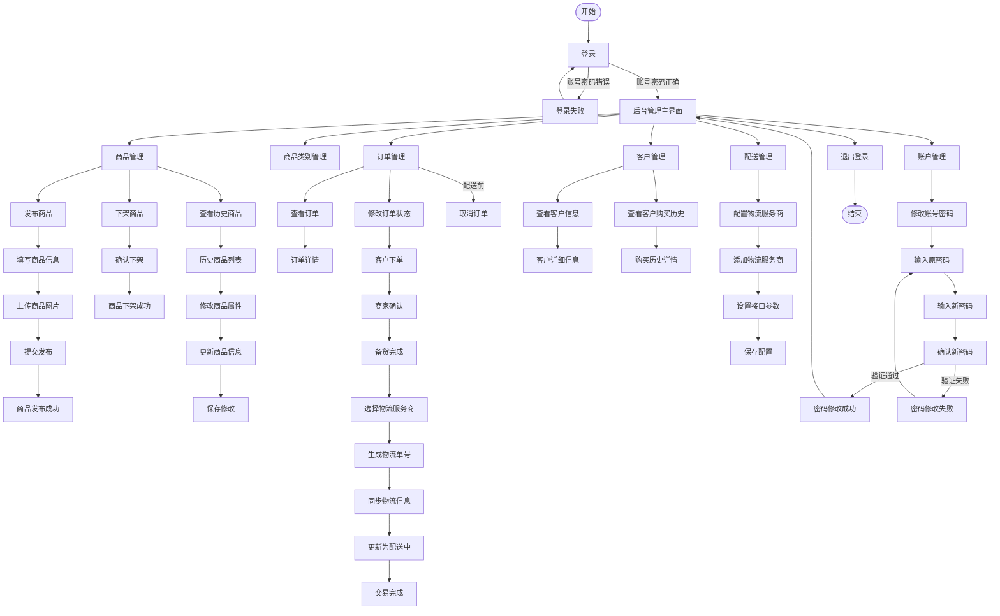

```mermaid
flowchart TD
    Start(["开始"]) --> Login["登录"]
    Login -- 账号密码错误 --> LoginFail["登录失败"]
    LoginFail --> Login
    Login -- 账号密码正确 --> Dashboard["后台管理主界面"]
    Dashboard --> ProductManagement["商品管理"] & CategoryManagement["商品类别管理"] & OrderManagement["订单管理"] & CustomerManagement["客户管理"] & LogisticsManagement["配送管理"] & AccountManagement["账户管理"] & Logout["退出登录"]
    ProductManagement --> AddProduct["发布商品"] & RemoveProduct["下架商品"] & ViewHistoryProducts["查看历史商品"]
    AddProduct --> FillProductInfo["填写商品信息"]
    FillProductInfo --> UploadImages["上传商品图片"]
    SubmitProduct["提交发布"] --> ProductPublished["商品发布成功"]
    ConfirmRemoval["确认下架"] --> ProductRemoved["商品下架成功"]
    ViewHistoryProducts --> HistoryProductList["历史商品列表"]
    HistoryProductList --> EditProduct["修改商品属性"]
    EditProduct --> UpdateProductInfo["更新商品信息"]
    UpdateProductInfo --> SaveProductChanges["保存修改"]
    OrderManagement --> ViewOrders["查看订单"] & UpdateOrderStatus["修改订单状态"]
    OrderManagement -- "<span style=color:>配送前</span>" --> CancelOrder["取消订单"]
    ViewOrders --> OrderDetails["订单详情"]
    UpdateOrderStatus --> CustomerOrder["客户下单"]
    CustomerOrder --> MerchantConfirm["商家确认"]
    MerchantConfirm --> StockReady["备货完成"]
    StockReady --> SelectLogistics["选择物流服务商"]
    SelectLogistics --> GenerateTrackingNumber["生成物流单号"]
    GenerateTrackingNumber --> SyncLogisticsInfo["同步物流信息"]
    SyncLogisticsInfo --> UpdateToDelivering["更新为配送中"]
    CustomerManagement --> ViewCustomerInfo["查看客户信息"] & ViewPurchaseHistory["查看客户购买历史"]
    ViewCustomerInfo --> CustomerDetails["客户详细信息"]
    ViewPurchaseHistory --> PurchaseHistoryDetails["购买历史详情"]
    LogisticsManagement --> ConfigureLogistics["配置物流服务商"]
    ConfigureLogistics --> AddLogisticsProvider["添加物流服务商"]
    AddLogisticsProvider --> SetupInterface["设置接口参数"]
    SetupInterface --> SaveConfiguration["保存配置"]
    AccountManagement --> ChangePassword["修改账号密码"]
    ChangePassword --> InputOldPassword["输入原密码"]
    InputOldPassword --> InputNewPassword["输入新密码"]
    InputNewPassword --> ConfirmNewPassword["确认新密码"]
    ConfirmNewPassword -- 验证通过 --> PasswordChanged["密码修改成功"]
    ConfirmNewPassword -- 验证失败 --> PasswordChangeFailed["密码修改失败"]
    PasswordChangeFailed --> InputOldPassword
    PasswordChanged --> Dashboard
    Logout --> End(["结束"])
    RemoveProduct --> ConfirmRemoval
    UploadImages --> SubmitProduct
    UpdateToDelivering --> TransactionComplete["交易完成"]


```